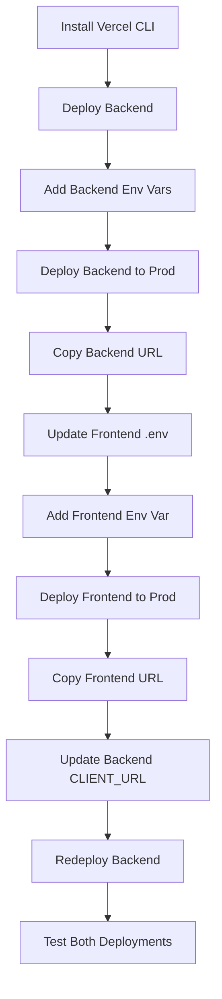

# 🎯 Quick Deployment Cheat Sheet

## 🚀 Deploy Backend (3 Steps)

### Step 1: Initial Deploy
```bash
cd server
vercel
```

### Step 2: Add Environment Variables
```bash
# DATABASE_URL
vercel env add DATABASE_URL production
# Paste: your-neon-connection-string

# JWT_SECRET
vercel env add JWT_SECRET production
# Enter: any-secure-random-string-32-chars-minimum

# NODE_ENV
vercel env add NODE_ENV production
# Enter: production

# CLIENT_URL (optional now)
vercel env add CLIENT_URL production
# Press Enter to skip
```

### Step 3: Deploy to Production
```bash
vercel --prod
```
✅ **Copy backend URL**: `https://your-backend.vercel.app`

---

## 🎨 Deploy Frontend (3 Steps)

### Step 1: Update .env
Edit `.env`:
```bash
VITE_API_URL=https://your-backend.vercel.app/api
```

### Step 2: Add Environment Variable
```bash
vercel env add VITE_API_URL production
# Enter: https://your-backend.vercel.app/api
```

### Step 3: Deploy to Production
```bash
vercel --prod
```
✅ **Copy frontend URL**: `https://your-frontend.vercel.app`

---

## 🔄 Update Backend with Frontend URL

```bash
cd server
vercel env add CLIENT_URL production
# Enter: https://your-frontend.vercel.app

vercel --prod
```

---

## ⚡ Alternative: Use PowerShell Scripts

### Deploy Backend:
```powershell
.\deploy-backend.ps1
```

### Deploy Frontend:
```powershell
.\deploy-frontend.ps1
```

---

## 📋 Environment Variables Checklist

### Backend (server)
- [ ] `DATABASE_URL` - Neon PostgreSQL connection string
- [ ] `JWT_SECRET` - Secure random string (32+ chars)
- [ ] `NODE_ENV` - Set to `production`
- [ ] `CLIENT_URL` - Frontend URL (add after frontend deployment)

### Frontend (root)
- [ ] `VITE_API_URL` - Backend API URL with `/api` suffix

---

## 🧪 Test Deployments

### Test Backend:
```bash
curl https://your-backend.vercel.app/api/health
```

Expected:
```json
{
  "status": "ok",
  "message": "SecretLease API is running"
}
```

### Test Frontend:
1. Open: `https://your-frontend.vercel.app`
2. Login as admin:
   - Email: `admin@secretlease.com`
   - Password: `admin123`
3. Check console for errors (F12)

---

## 🛠️ Common Commands

```bash
# View logs
vercel logs

# List environment variables
vercel env ls

# List deployments
vercel ls

# Remove environment variable
vercel env rm VARIABLE_NAME production

# Rollback to previous deployment
vercel rollback

# Open project in Vercel dashboard
vercel open
```

---

## 🎯 Complete Deployment Flow



---

## 📞 Need Help?

- **Vercel Docs**: https://vercel.com/docs
- **Neon Docs**: https://neon.tech/docs
- **Project Readme**: See `VERCEL_DEPLOYMENT.md` for detailed guide

---

**Ready to deploy?** Run `.\deploy-backend.ps1` to start! 🚀
