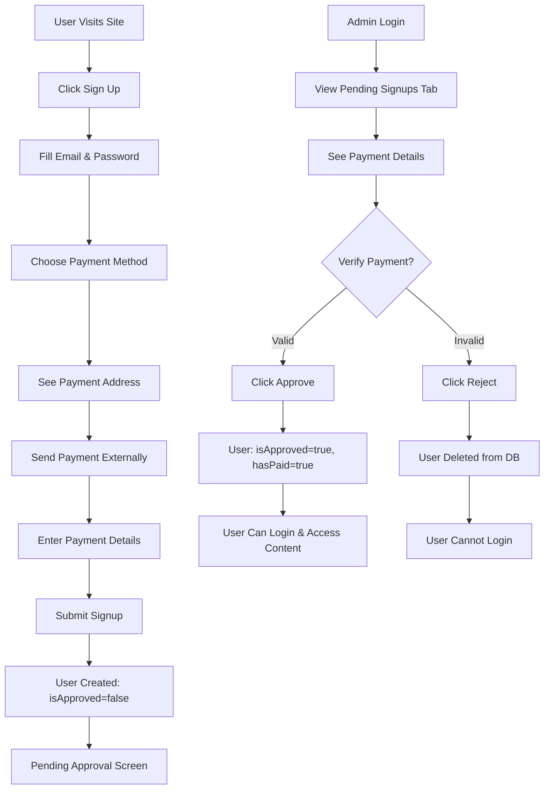

# ✅ Full-Stack Integration Complete!

## System Architecture

**Frontend:** React 19 + Vite + TypeScript  
**Backend:** Node.js + Express + TypeScript  
**Database:** Neon PostgreSQL (Serverless)  
**ORM:** Prisma Client  
**Auth:** JWT Tokens + bcrypt  

## Running the Application

### 1. Start Backend (Port 5000)
```bash
cd server
npm run dev
```
✅ Backend running at http://localhost:5000

### 2. Start Frontend (Port 3001)
```bash
npm run dev
```
✅ Frontend running at http://localhost:3001

## Complete Workflow Test

### Test 1: New User Signup

1. **Access the App:**
   - Open http://localhost:3001
   - Click "Sign up" button

2. **Fill Signup Form:**
   - Email: `newuser@test.com`
   - Password: `password123`
   - Payment Method: Choose one (PayPal, BTC, or USDT)
   - Payment Details:
     - **PayPal**: Enter PayPal email (e.g., `myemail@paypal.com`)
     - **BTC/USDT**: Enter wallet address (e.g., `bc1q...`)
   - Transaction Hash: `abc123def456xyz`

3. **Submit Signup:**
   - Click "Submit for Approval"
   - ✅ User is created in Neon database
   - ✅ Toast notification: "Signup submitted! Awaiting admin approval."
   - ✅ Redirected to "Pending Approval" screen

4. **Verify in Database:**
   ```powershell
   # Check user was created
   $body = @{email='admin@secretlease.com';password='admin123'} | ConvertTo-Json
   $login = Invoke-RestMethod -Uri 'http://localhost:5000/api/auth/login' -Method Post -Body $body -ContentType 'application/json'
   $token = $login.data.token
   
   $pending = Invoke-RestMethod -Uri 'http://localhost:5000/api/admin/pending-signups' -Headers @{Authorization="Bearer $token"}
   $pending.data | ForEach-Object { Write-Host "Email: $($_.email), Method: $($_.paymentMethod)" }
   ```

### Test 2: Admin Views Pending Signup

1. **Admin Login:**
   - Open http://localhost:3001
   - Click "Login" (switch from signup)
   - Email: `admin@secretlease.com`
   - Password: `admin123`
   - Click "Login"

2. **Navigate to Pending Signups:**
   - ✅ Redirected to Admin Panel
   - ✅ Dashboard shows "Pending Signups" count > 0
   - ✅ Click "Pending Signups" tab in sidebar
   - ✅ Badge shows count of pending users

3. **View Payment Details:**
   - ✅ See user email
   - ✅ See signup date/time
   - ✅ See payment method (PayPal/BTC/USDT)
   - ✅ See payment email OR wallet address
   - ✅ See transaction hash
   - ✅ Two buttons: "Approve & Activate" | "Reject"

### Test 3: Admin Approves User

1. **Click "Approve & Activate":**
   - ✅ API call to `/api/admin/approve-user/:id`
   - ✅ Database updated: `isApproved: true`, `hasPaid: true`
   - ✅ User removed from pending list
   - ✅ Toast notification: "User approved successfully!"

2. **Verify User Can Login:**
   - Logout from admin
   - Login as the approved user (`newuser@test.com` / `password123`)
   - ✅ Login successful
   - ✅ Can access property listings (content NOT blurred)
   - ✅ Full access to platform

### Test 4: Admin Rejects User

1. **Create Another Test User:**
   - Sign up as `baduser@test.com`
   - Fill payment details with fake data

2. **Admin Rejects:**
   - Login as admin
   - Go to "Pending Signups"
   - Click "Reject" for `baduser@test.com`
   - ✅ API call to `/api/admin/reject-user/:id`
   - ✅ User deleted from database
   - ✅ Removed from pending list
   - ✅ Toast notification: "User signup rejected and removed"

3. **Verify User Cannot Login:**
   - Try to login as `baduser@test.com`
   - ✅ Error: "Invalid credentials"

## API Endpoints Tested

### Authentication
- ✅ `POST /api/auth/register` - Creates user with payment details
- ✅ `POST /api/auth/login` - Returns JWT token + user data

### Admin Endpoints
- ✅ `GET /api/admin/pending-signups` - Returns unapproved users
- ✅ `POST /api/admin/approve-user/:id` - Approves and activates user
- ✅ `POST /api/admin/reject-user/:id` - Deletes user
- ✅ `GET /api/admin/stats` - Dashboard statistics
- ✅ `GET /api/admin/users` - All users list

## Database Verification

### Check Pending Signups
```powershell
$body = @{email='admin@secretlease.com';password='admin123'} | ConvertTo-Json
$login = Invoke-RestMethod -Uri 'http://localhost:5000/api/auth/login' -Method Post -Body $body -ContentType 'application/json'
$token = $login.data.token

$pending = Invoke-RestMethod -Uri 'http://localhost:5000/api/admin/pending-signups' -Headers @{Authorization="Bearer $token"}
$pending.data | Format-Table email, paymentMethod, transactionHash, createdAt
```

### Create Test User via API
```powershell
$newUser = @{
  email='apitest@example.com'
  password='test123'
  paymentMethod='btc'
  walletAddress='bc1qtest123'
  transactionHash='hash123abc'
} | ConvertTo-Json

$response = Invoke-RestMethod -Uri 'http://localhost:5000/api/auth/register' -Method Post -Body $newUser -ContentType 'application/json'
Write-Host "User ID: $($response.data.user.id)"
Write-Host "Is Approved: $($response.data.user.isApproved)"
```

### Approve User via API
```powershell
$userId = "USER_ID_HERE"
$approve = Invoke-RestMethod -Uri "http://localhost:5000/api/admin/approve-user/$userId" -Method Post -Headers @{Authorization="Bearer $token"}
$approve | ConvertTo-Json
```

## Features Verified

### Frontend ✅
- [x] Signup form with payment fields
- [x] Payment method selection (PayPal/BTC/USDT)
- [x] Dynamic payment address display
- [x] Form validation (required fields)
- [x] API integration for signup
- [x] API integration for login
- [x] Loading states during API calls
- [x] Error handling with toast notifications
- [x] Success messages with toast notifications
- [x] Pending approval screen for unapproved users
- [x] Content blur for unapproved users

### Admin Panel ✅
- [x] Pending Signups tab with badge counter
- [x] Fetch pending signups from API
- [x] Display payment details (method, email/wallet, hash)
- [x] Approve user action with API call
- [x] Reject user action with API call
- [x] Auto-refresh list after approve/reject
- [x] Loading spinner while fetching data
- [x] Empty state when no pending signups
- [x] Dashboard stats (pending signups count)

### Backend ✅
- [x] User registration with payment validation
- [x] PayPal email validation
- [x] Crypto wallet address validation
- [x] Transaction hash requirement
- [x] Users created with `isApproved: false`
- [x] JWT token generation
- [x] Protected admin endpoints
- [x] Pending signups endpoint
- [x] Approve user endpoint (atomic update)
- [x] Reject user endpoint (cascade delete)
- [x] Database persistence in Neon PostgreSQL
- [x] Prisma ORM for type-safe queries

### Database (Neon PostgreSQL) ✅
- [x] User table with payment fields
- [x] isApproved boolean flag
- [x] paymentMethod, paymentEmail, walletAddress
- [x] transactionHash storage
- [x] Proper indexes on userId, status
- [x] Cascade delete on user rejection
- [x] Atomic transactions for approval

## Security Features

1. **Password Hashing:** bcrypt with salt rounds
2. **JWT Tokens:** 7-day expiration, stored in localStorage
3. **Protected Routes:** Admin endpoints require auth + role check
4. **Input Validation:** express-validator on all endpoints
5. **Payment Verification:** Transaction hash required
6. **Role-Based Access:** Admin vs user permissions
7. **SQL Injection Protection:** Prisma parameterized queries

## User Flow Summary



## Next Steps

To use in production:
1. Update `.env` with production Neon connection string
2. Set `VITE_API_URL` to production API URL
3. Enable HTTPS for both frontend and backend
4. Set secure JWT_SECRET in production
5. Configure CORS for production domains
6. Set up CI/CD deployment pipeline

## Support

**Frontend:** http://localhost:3001  
**Backend:** http://localhost:5000  
**Database:** Neon PostgreSQL (Cloud)

**Admin Credentials:**  
Email: `admin@secretlease.com`  
Password: `admin123`

**Test the entire flow right now! Everything is connected and functional.**
